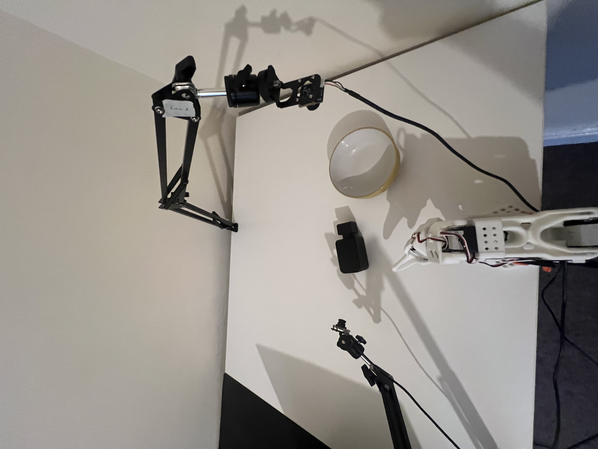
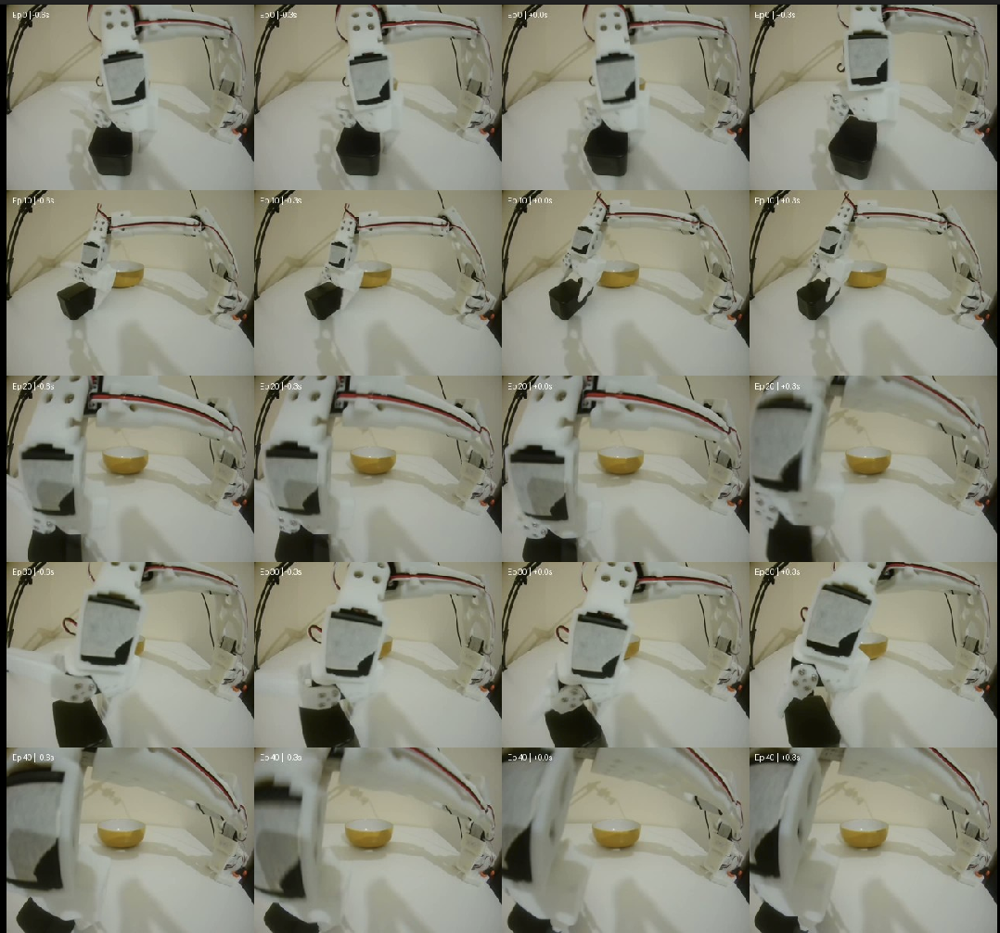

# SO-101 Robot Learning

An end-to-end robotics and imitation-learning project using the SO-101 leader-follower arm, dual-camera vision, and an ACT policy.

The goal was to build the system from the hardware level upward, collect demonstrations, diagnose failures, improve the dataset and camera setup, and train a policy to autonomously pick up a black perfume bottle and place it into a yellow bowl.

## Demo

The final system performs vision-based autonomous pick-and-place using two camera observations and the follower arm's joint state.

[Final autonomous demonstration](media/videos/final_demo.mov)

## System

- SO-101 leader and follower arms
- 6 smart servos per arm
- Dual USB cameras
- Ubuntu 24.04
- LeRobot 0.6.2
- PyTorch + CUDA
- ACT (Action Chunking Transformer)
- NVIDIA GTX 1050 Ti

During data collection, the leader arm provides demonstrations while the follower reproduces the commanded joint motion.

[Teleoperation demonstration](media/videos/teleoperation.mov)

The policy later replaces the human-controlled leader and predicts follower actions from camera observations and robot state.

## Learning Pipeline

The project followed this pipeline:

**Hardware assembly → servo configuration → calibration → teleoperation → dual-camera setup → demonstration collection → ACT training → autonomous evaluation → failure analysis → dataset redesign**

The task was evaluated across five bottle positions in the workspace.

## Experiments

### Dataset 1 — Initial Baseline

30 demonstrations were collected.

The learned policy struggled with localization and grasp precision. Of five tested workspace positions, only the middle position showed partial success; the other four resulted in misses.

### Dataset 2 — More Demonstrations

The dataset was expanded to 50 demonstrations distributed across five workspace regions.

The policy became much better at reaching the bottle, but several positions showed a systematic failure: the lower part of the gripper contacted the bottle instead of positioning the jaws around it.

Further training improved motion quality but did not eliminate this spatial grasp error.

### Failure Analysis

Inspection of the demonstrations revealed that the side camera could become heavily occluded by the robot during grasping.

This suggested that the problem was not simply insufficient training. The policy sometimes lacked a clear visual observation of the geometry needed for precise grasping.

The side camera was repositioned to provide a wider and more consistent view of the gripper-object interaction.

### Dataset 3 — Improved Observability

A new 50-demonstration dataset was recorded using the improved camera geometry.

This experiment tests whether improving the robot's observations can solve a failure that additional training alone could not.

## Training

ACT was trained using the dual-camera images and six-dimensional robot joint state.

The project compared policies across multiple datasets and training checkpoints rather than treating training loss alone as evidence of successful robot behavior.

## Key Lessons

This project demonstrated several important robotics and machine-learning principles:

- Reliable hardware and calibration are prerequisites for learning.
- Dataset quality matters as much as dataset quantity.
- Camera placement changes what information is available to a learned policy.
- Systematic failures should be diagnosed rather than addressed only by increasing training time.
- Training loss alone does not measure real-world task success.
- Controlled experiments make improvements easier to interpret.

## Documentation

More detailed notes are available here:

- [Hardware](docs/hardware.md)
- [Software and setup](docs/setup.md)
- [Experiments and failure analysis](docs/experiments.md)
- [Evaluation results](results/evaluation.md)

## Project Status

V1 complete: end-to-end autonomous vision-based pick-and-place, from hardware assembly and demonstration collection through ACT training and real-world evaluation.