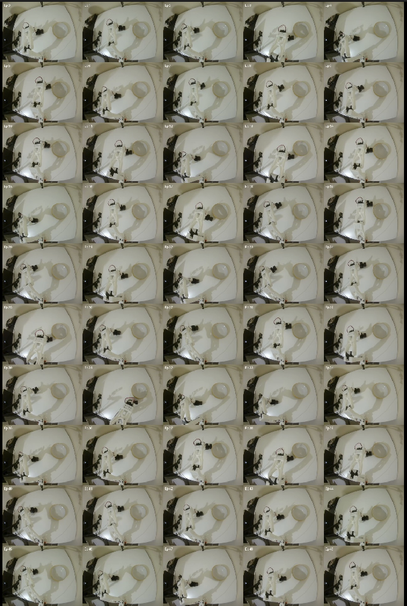
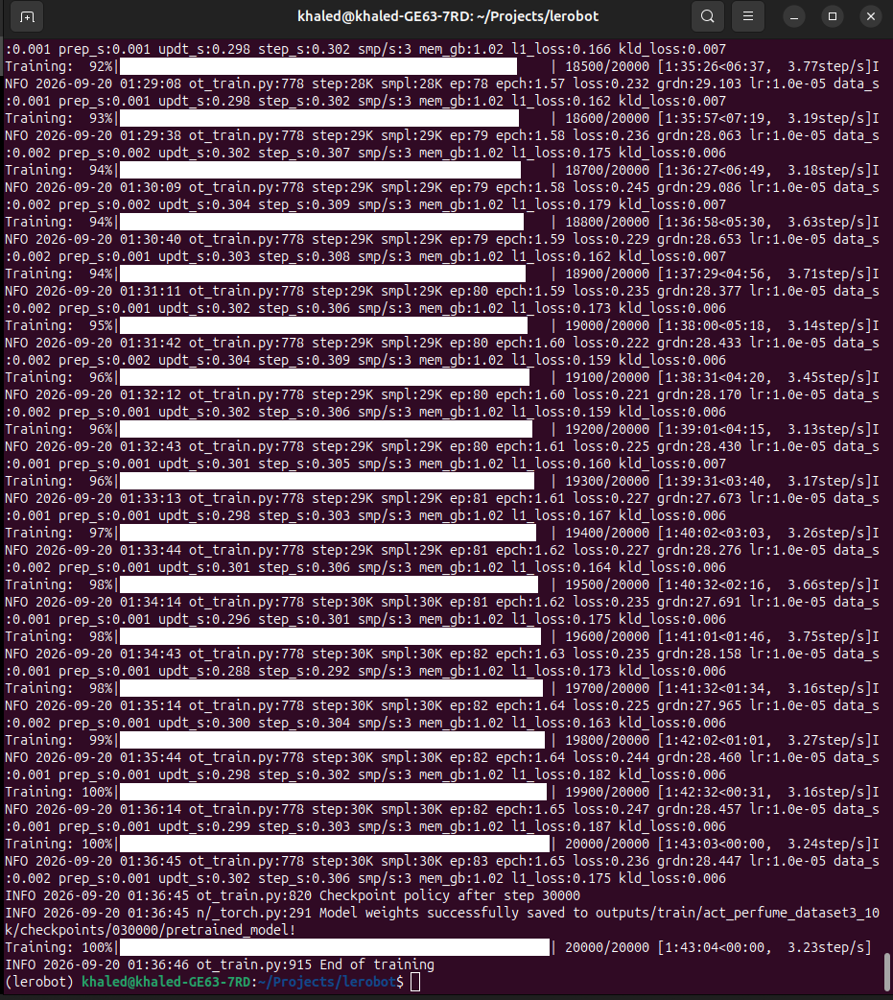

# Software and Setup

## Development Environment

The project was developed on Ubuntu 24.04 using:

- Python 3.12
- Miniforge / Conda
- LeRobot 0.6.2
- PyTorch 2.11
- NVIDIA CUDA
- Git and GitHub

The robot software is based on Hugging Face LeRobot, with Feetech servo communication used for the SO-101 hardware.

## Robot Configuration

The follower and leader each use six joints:

| ID | Joint |
|---|---|
| 1 | Shoulder pan |
| 2 | Shoulder lift |
| 3 | Elbow flex |
| 4 | Wrist flex |
| 5 | Wrist roll |
| 6 | Gripper |

Each arm uses a shared servo bus. Servos on the same bus share communication wiring and baud rate but require unique IDs.

## Camera Configuration

Two USB cameras provide complementary observations:

- **Top camera:** global object and workspace position
- **Side camera:** approach and grasp geometry

Both cameras were configured at 640 × 480 resolution and 30 FPS.

## Control Modes

### Teleoperation

The leader arm provides joint-position targets to the follower:

Leader → Computer → Follower

### Autonomous Control

For autonomous operation, the leader is removed from the control loop:

Cameras + follower joint state → ACT policy → follower joint targets

## Reproducing the Project

This section documents the main software and hardware interfaces used in the project.

### Environment

The project was developed inside a dedicated Conda environment:

```bash
conda activate lerobot
```

This activates the Python environment containing LeRobot and the required dependencies.

### Hardware Interfaces

The follower and leader arms communicate with the computer through USB serial devices.

During this project they appeared as:

```text
Follower: /dev/ttyACM0
Leader:   /dev/ttyACM1
```

The two USB cameras appeared as:

```text
Top camera:  /dev/video2
Side camera: /dev/video4
```

These Linux device numbers can change when hardware is disconnected or reconnected, so they should be verified before running the robot.

### Teleoperation

Before collecting demonstrations, the leader arm was used to control the follower arm in real time.

The control flow was:

```text
Human → Leader arm → Computer → Follower arm
```

The leader servos report their joint positions to the computer. LeRobot reads these positions and sends corresponding target positions to the follower servos.

This stage was used to verify that:

- all six joints were mapped correctly,
- calibration was correct,
- the leader and follower moved consistently,
- the robot was ready for demonstration collection.

### Dataset Recording

Demonstrations were recorded through teleoperation while two cameras observed the workspace.

Each recorded timestep contained:

- the follower arm's six joint positions,
- the commanded six-joint action,
- the top-camera image,
- the side-camera image.

The final dataset used:

```text
Dataset:      so101_dataset3
Episodes:     50
Frames:       18,158
Frequency:    30 FPS
Top camera:   640 × 480
Side camera:  640 × 480
Task:         Pick up the black rectangular perfume bottle and place it in the yellow bowl.
```

The 50 demonstrations were deliberately distributed across five bottle regions in the workspace, with approximately 10 demonstrations per region.

This was done to provide the policy with examples covering different starting positions rather than repeatedly demonstrating the task from one location.



Dataset 3 was recorded after repositioning the side camera to improve visibility of the bottle and gripper during grasping.

### ACT Training

The final Dataset 3 policy was trained using ACT (Action Chunking Transformer).

The 10,000-step training run used:

```bash
lerobot-train \
  --dataset.repo_id=so101_dataset3 \
  --dataset.root=/home/khaled/.cache/huggingface/lerobot/so101_dataset3 \
  --policy.type=act \
  --policy.device=cuda \
  --policy.push_to_hub=false \
  --output_dir=outputs/train/act_perfume_dataset3_10k \
  --job_name=act_perfume_dataset3_10k \
  --batch_size=1 \
  --steps=10000 \
  --save_checkpoint=true \
  --save_freq=2000 \
  --log_freq=100 \
  --wandb.enable=false
```

Important arguments:

- `--dataset.repo_id` identifies the dataset.
- `--dataset.root` specifies where the dataset is stored locally.
- `--policy.type=act` selects the ACT imitation-learning policy.
- `--policy.device=cuda` performs training on the NVIDIA GPU.
- `--batch_size=1` processes one training sample per optimisation step.
- `--steps=10000` performs 10,000 optimiser/ training steps.
- `--save_freq=2000` saves a checkpoint every 2,000 training steps.
- `--output_dir` specifies where training outputs and checkpoints are stored.

Training produced a checkpoint at:

```text
outputs/train/act_perfume_dataset3_10k/checkpoints/010000/pretrained_model
```

### Continued Training to 30,000 Steps

After evaluating the 10,000-step checkpoint on the physical robot, training was resumed from the existing checkpoint for an additional 20,000 training steps.

This produced a total of 30,000 training steps rather than starting a new model from scratch.

The final policy checkpoint was:

```text
outputs/train/act_perfume_dataset3_10k/checkpoints/030000/pretrained_model
```

The 30,000-step checkpoint was used for the final autonomous evaluation.

Training loss was monitored during optimisation, but real-world autonomous evaluation was used to determine whether the policy had actually learned the manipulation task.



### Autonomous Inference

After training, the leader arm is no longer used. Control becomes:

```text
Cameras + follower joint state
            ↓
        ACT policy
            ↓
     Predicted actions
            ↓
       Follower arm
```

Trained policies are deployed using LeRobot's `lerobot-rollout` command.

The project used the `base` rollout strategy for autonomous evaluation. This runs the policy on the physical robot without recording a new training dataset.

The final Dataset 3 30,000-step policy checkpoint was:

```text
outputs/train/act_perfume_dataset3_10k/checkpoints/030000/pretrained_model

During evaluation, the policy received observations from the top and side cameras together with the follower's current joint state and generated the follower's actions autonomously.

Evaluation was performed across the same five workspace regions used during dataset collection. This allowed policies trained on different datasets and training durations to be compared under similar physical conditions.

The final autonomous behavior is shown here:

[Final autonomous demonstration](../media/videos/final_demo.mov)